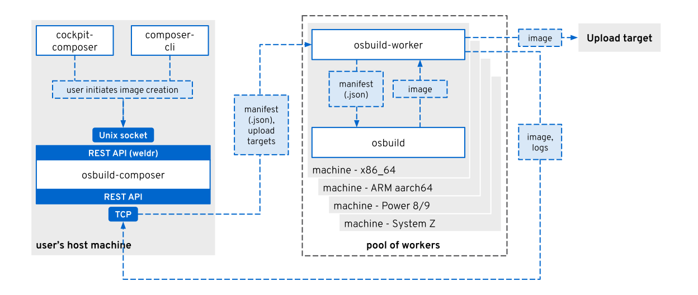

OSBuild Composer
================

Operating System Image Composition Services

The composer project is a set of HTTP services for composing operating system
images. It builds on the pipeline execution engine of *osbuild* and defines
its own class of images that it supports building.

Multiple APIs are available to access a composer service. This includes
support for the [lorax-composer](https://github.com/weldr/lorax) API, and as
such can serve as drop-in replacement for lorax-composer.

You can control a composer instance either directly via the provided APIs, or
through higher-level user-interfaces from external projects. This, for
instance, includes a
[Cockpit Module](https://github.com/osbuild/cockpit-composer) or using the
[composer-cli](https://weldr.io/lorax/composer-cli.html) command-line tool.

### Project

 * **Website**: <https://www.osbuild.org>
 * **Bug Tracker**: <https://github.com/osbuild/osbuild-composer/issues>
 * **IRC**: #osbuild on [Libera.Chat](https://libera.chat/)
 * **Changelog**: <https://github.com/osbuild/osbuild-composer/releases>

#### Contributing

Please refer to the [developer guide](https://www.osbuild.org/guides/developer-guide/developer-guide.html) to learn about our workflow, code style and more.

### About

Composer is a middleman between the workhorses from *osbuild* and the
user-interfaces like *cockpit-composer*, *composer-cli*, or others. It defines
a set of high-level image compositions that it supports building. Builds of
these compositions can be requested via the different APIs of *Composer*, which
will then translate the requests into pipeline-descriptions for *osbuild*. The
pipeline output is then either provided back to the user, or uploaded to a user
specified target.

The following image visualizes the overall architecture of the OSBuild
infrastructure and the place that *Composer* takes:



Consult the `osbuild-composer(7)` man-page for an introduction into composer,
information on running your own composer instance, as well as details on the
provided infrastructure and services.

### Requirements

The requirements for this project are:

 * `osbuild >= 26`
 * `systemd >= 244`

At build-time, the following software is required:

 * `go >= 1.18`
 * `python-docutils >= 0.13`
 * `krb5-devel` for fedora/rhel or `libkrb5-dev` for debian/ubuntu`

### Build

The standard go package system is used. Consult upstream documentation for
detailed help. In most situations the following commands are sufficient to
build and install from source:

```sh
make build
```

The man-pages require `python-docutils` and can be built via:

```sh
make man
```

### Repository:

 - **web**:   <https://github.com/osbuild/osbuild-composer>
 - **https**: `https://github.com/osbuild/osbuild-composer.git`
 - **ssh**:   `git@github.com:osbuild/osbuild-composer.git`

### Pull request gating

Each pull request against `osbuild-composer` starts a series of automated
tests. Tests run via GitHub Actions and Jenkins. Each push to the pull request
will launch theses tests automatically.

Jenkins only tests pull requests from members of the `osbuild` organization in
GitHub. A member of the `osbuild` organization must say `ok to test` in a pull
request comment to approve testing. Anyone can ask for testing to run by
saying the bot's favorite word, `schutzbot`, in a pull request comment.
Testing will begin shortly after the comment is posted.

Test results in Jenkins are available by clicking the *Details* link on the
right side of the Schutzbot check in the pull request page.

### License:

 - **Apache-2.0**
 - See LICENSE file for details.
