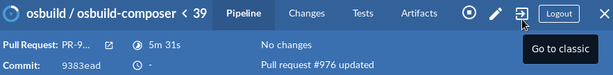
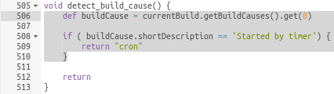
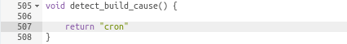

# osbuild-composer testing information

With the exception of unit tests, all the osbuild-composer tests are shipped
in a dedicated RPM: osbulid-composer-tests, and they are meant to be installed
onto a pristine system and executed from there, rather than executed from a
git checkout.

Test cases are found in `test/cases`. They are intended to be independent of
each other and they are installed into `/usr/libexec/tests/osbuild-composer/`,
with any supporting test-data in `/usr/share/tests/osbuild-composer/`, and
helper binaries in `/usr/libexec/osbuild-composer-test/`.

Provisioning and orchestration of test-systems, as well as configuring what
distros, versions and architectures to test against is out of scope of the
tests themselves. For osbuild-composer CI, schutzbot is used, which can be
found in the directory by the same name.


## Golang tests

Test binaries, regardless of their scope/type (e.g. unit, API, integration)
that are written in Golang must follow the syntax of the Go
[testing package](https://golang.org/pkg/testing/), that is implement only
`TestXxx` functions with their setup/teardown when necessary in a `yyy_test.go`
file.

Test scenario discovery, execution and reporting will be handled by `go test`.

Some test files will be executed directly by `go test` during rpm build time
and/or in CI. These are usually unit tests. Scenarios which require more complex
setup, e.g. a running osbuild-composer are not intented to be executed directly
by `go test` at build time. Instead they are intended to be executed as
stand-alone test binaries on a clean system which has been configured in
advance (because this is easier/more feasible). These stand-alone test binaries
are also compiled via `go test -c -o` during rpm build or via `make build`.
See *Integration testing* for more information.

When comparing for expected values in test functions you should use the
[testify/assert](https://godoc.org/github.com/stretchr/testify/assert) or
[testify/require](https://godoc.org/github.com/stretchr/testify/require)
packages. Both of them provide an impressive array of assertions with the
possibility to use formatted strings as error messages. For example:

```
assert.Nilf(t, err, "Failed to set up temporary repository: %v", err)
```

If you want to fail immediately, not doing any more of the asserts use the
`require` package instead of the `assert` package, otherwise you'll end up with
panics and nil pointer memory problems.

Stand-alone test binaries also have the `-test.failfast` option.

Code coverage is recorded in
[codecov.io](https://codecov.io/github/osbuild/osbuild-composer).
This information comes only from unit tests and for the time being
we're not concerned with collecting coverage information from integration
tests, see `.github/workflows/tests.yml`.


## Image tests

In the `test/data/manifests` directory, sample image builds and their tests are
collected for the various distros, architectures, configuration we support.

Each test case describes how the image is built, the expected osbuild
manifest used internally, the expected image-info output and how to
boot-test the image.

To (re)generate these test cases use the tool
`tools/test-case-generators/generate-test-cases`.
Note that the `generate-test-cases` tool must be run on a host with
the same architecture, as the one intended for the generated test
cases. In other words, you need to generate e.g test cases for `aarch64`
images on an `aarch64` host.

Alternatively to (re)generate test cases for all architectures, or just
the ones different from your host's architecture, you can use the tool
`tools/test-case-generators/generate-all-test-cases`. It creates
an ephemeral virtual machine for each necessary architecture using the
`qemu-system-<arch>` command and generates test cases using the
`generate-test-cases` tool inside the virtual machine. It is important
to note that test case generation in virtual machines may take several
hours. The `generate-all-test-cases` currently does not work with RHEL
images because of missing "9p" filesystem support.

### Setting up Azure upload tests

By default, the vhd images are run locally using qemu. However, when
the right set of environment flags is passed to the osbuild-image-tests,
it uploads the image to Azure, boots it and tries to ssh into it.

#### Required flags
- `AZURE_STORAGE_ACCOUNT`
- `AZURE_STORAGE_ACCESS_KEY`
- `AZURE_CONTAINER_NAME`
- `AZURE_SUBSCRIPTION_ID`
- `AZURE_CLIENT_ID`
- `AZURE_CLIENT_SECRET`
- `AZURE_TENANT_ID`
- `AZURE_LOCATION`
- `AZURE_RESOURCE_GROUP`

#### Setting up all the required resources

1) Firstly, go to *Subscriptions* in the left-side menu. Here you can find
   the `AZURE_SUBSCRIPTION_ID`.

2) Now, you need to create a new resource group. In the left-side menu,
   select *Resource groups*. Click on *Add* above the resource group list.
   The name you choose is your `AZURE_RESOURCE_GROUP`. The region you choose
   is your `AZURE_LOCATION`. However, it must be in the "machine-readable
   form". You can list all the locations with their machine-readable names
   using Azure CLI: `az account list-locations -o table`.
   E.g. the machine-readable name of US East location is `eastus`.
   
   Note that terms *location* and *region* are synonyms in Azure's context.

3) Storage time! Go to Storage accounts in the left-side menu. Click on
   *Add* above the list. Use the resource group you created in
   the previous step. Also, the region should be the same. The name you
   choose is your `AZURE_STORAGE_ACCOUNT`.

   After the storage account is created, open it.
   Select *Settings > Access keys*. Choose one of the keys, this is your
   `AZURE_STORAGE_ACCESS_KEY`. Select *Blob service > Containers* and create
   a new one. Its name is your `AZURE_CONTAINER_NAME`.

4) Now it’s time to create an application. This is needed because Azure uses
   OAuth to do authorization. In the left-side menu, choose *Azure Active
   Directory*. Go to *Manage > App registrations* and register a new
   application.

   When it’s created, open it. In the overview, you can see
   the Application (client) ID and the Directory (tenant) ID. These are your
   `AZURE_CLIENT_ID` and `AZURE_TENANT_ID`.

   Now, go to *Manage > Certificates & Secrets* under your new application
   and create a new client secret. The is your `AZURE_CLIENT_SECRET`.

5) The last step is to give the new application access to the resource group.
   This step must be done by Azure administrator (@larskarlitski): Go to
   the *Access control (IAM)* section under the newly created resource group.
   Here, add the new application with the *Developer* role.

### Setting up OpenStack upload tests

The following environment variables are required

- `OS_AUTH_URL`
- `OS_USERNAME`
- `OS_PASSWORD`
- `OS_PROJECT_ID`
- `OS_DOMAIN_NAME`


### Setting up VMware vCenter upload tests

The following environment variables are required

- `GOVMOMI_URL` - vCenter hostname
- `GOVMOMI_USERNAME`
- `GOVMOMI_PASSWORD`
- `GOVMOMI_DATACENTER`
- `GOVMOMI_CLUSTER`
- `GOVMOMI_NETWORK`
- `GOVMOMI_DATASTORE`
- `GOVMOMI_FOLDER`
- `GOVMOMI_INSECURE` - value of 1 will skip checking SSL certificates

**WARNING:** when configuring the credentials for Schutzbot we've experienced
an issue where the first line in the credentials file gets lost resulting in
incomplete credentials. The work-around is to define a dummy ENV variable on
the first line!

## Integration testing

Since `osbuild-composer` externally provides two types of API, there also
multiple types of integration tests available.

Types of APIs tested:
- *Weldr API* - the original API provided by `lorax-composer`, for which
  `osbuild-composer` is a drop-in replacement. This API is mostly tested through
  the `composer-cli` tool, which consumes the *Weldr API*.
- *Cloud API* - the brand new API provided by `osbuild-composer`, which is
  currently used by the *Image Builder* service.

### Weldr API integration testing

This will consume the osbuild-composer *Weldr API* surface via the `composer-cli`
command line interface. Implementation is under
`cmd/osbuild-composer-cli-tests/`.

The easiest way to get started with integration testing from a git
checkout is:

* `dnf -y install rpm-build`
* `dnf -y builddep osbuild-composer.spec`
* `make rpm` to build the software under test
* `dnf install rpmbuild/RPMS/x86_64/osbuild-composer-*.rpm` - this will
  install both osbuild-composer, its -debuginfo, -debugsource and -tests packages
* `systemctl start osbuild-composer`
* `/usr/libexec/osbuild-composer-test/osbuild-composer-cli-tests` to execute
  the test suite.

It is best that you use a fresh system for installing and running the tests!

**NOTE:**

The easiest way to start osbuild-composer is via systemd because it takes care
of setting up the UNIX socket for the API server.

If you are working on a pull request that adds more integration tests
(without modifying osbuild-composer itself) then you can execute the test suite
from the local directory without installing it:

* `make build` - will build everything under `cmd/`
* `./osbuild-composer-cli-tests` - will execute the freshly built integration test suite

### Cloud API integration testing

*Cloud API* integration tests use the new REST API of `osbuild-composer` to request
an image build for a selected footprint. If the target is a public cloud environment
then the image is uploaded to the specific cloud provider as part of the compose.

The easiest way to get started with integration testing from a git
checkout is:

* `dnf -y install rpm-build`
* `dnf -y builddep osbuild-composer.spec`
* `make rpm` to build the software under test
* `dnf install rpmbuild/RPMS/x86_64/osbuild-composer-*.rpm` - this will
  install both osbuild-composer, its -debuginfo, -debugsource and -tests packages
* `systemctl start osbuild-composer`
* `/usr/libexec/tests/osbuild-composer/api.sh <CLOUD_PROVIDER>` to execute
  the integration testing with a specific cloud provider. Valid `CLOUD_PROVIDER`
  values are `aws` and `gcp`.

It is best that you use a fresh system for installing and running the tests!

The *Cloud API* integration testing usually consists from:

- Test existing *Cloud API* endpoints and their responses.
- Request a new compose.
- Test uploading of the image to specific cloud provider and sharing
  of the image with specified accounts.
- Optionally there are additional tests performed on the image, such as:
  - Create a VM instance with the cloud provider and uploaded image.
  - Run various checks on the VM instance.
- The last step is cleanup of resources uploaded and created with the cloud provider
  as part of the integration test.

#### Setting up AWS integration tests

The following environment variables are required

- `AWS_REGION`
- `AWS_BUCKET`
- `AWS_ACCESS_KEY_ID`
- `AWS_SECRET_ACCESS_KEY`
- `AWS_API_TEST_SHARE_ACCOUNT`

To execute the AWS integration tests, complete steps from *Cloud API integration testing*
section and run `/usr/libexec/tests/osbuild-composer/api.sh aws`.

#### Setting up GCP integration tests

The following environment variables are required:

- `GOOGLE_APPLICATION_CREDENTIALS` - path to [Google authentication credentials][gcp_creds] file.
- `GCP_REGION`
- `GCP_BUCKET`
- `GCP_API_TEST_SHARE_ACCOUNT`

To execute the GCP integration tests, complete steps from *Cloud API integration testing*
section and run `/usr/libexec/tests/osbuild-composer/api.sh gcp`.

[gcp_creds]: https://cloud.google.com/docs/authentication/getting-started#setting_the_environment_variable

## Downstream testing notes

To make it easier for us to test & verify downstream builds we are going to
move most of the work upstream and apply the following rules:

1. Preferably the 1st commit of any PR will contain a bug reproducer.
   First push a draft PR only containing that commit which will cause CI to FAIL.
2. QE will review and approve the reproducer (can happen in parallel with next item)
3. Subsequent commits provide bug fixes without modifying the reproducer and
   CI reports PASS. Push these on top of the approved reproducer.
4. QE has done final review and approved the PR; RHBZ status is set to
   `MODIFIED + Verified=Tested`
5. Devel has done final review and approved the PR

**NOTES for devel:**

Pull requests related to new functionality may add their
automated tests together or after commit(s) adding said functionality!

All PRs containing commits referencing `rhbz#` number and/or
all PRs against a dedicated `rhel-` branch should follow the above rules!

**NOTE for QE:**

CI results are also reported against each commit and these
can be used to review the test automation state during a PR lifecycle.

`qa_ack+` on RHBZ will be granted **after** a reproducer has been
identified and with the mutual understanding that PRs related to
that RHBZ must include an automated test reproducer.


## Cron jobs for nightly builds testing

The Schutzbot Pipeline contains conditional sections that facilitate test execution
against nightly builds. This is achieved by running different preparation steps while
the testing stage remains the same. The main difference is that SUT is not compiled
locally but installed directly from OS repositories!

### Replay nightly Pipeline manually

If you wish to execute the nightly Pipeline by hand, often to verify changes made to it
then do the following:

1. Wait for `schutzbot-psi/pr-head` to report any status on the pull request.
   This means a regular Pipeline has been started with changes coming from your PR; or
1. In Jenkins Blue Ocean UI locate the latest Pipeline execution triggered by timer
2. In Jenkins Blue Ocean UI, top-right corner, click ***Go to classic*** button:

   

3. In Jenkins Classic UI, left-hand sidebar click ***Replay*** button. This will allow you to
   replay a Pipeline with a modified syntax
4. Locate the  `detect_build_cause()` function near the bottom and modify it so that it
   will `return "cron"`. This is required because when Pipelines are restarted manually
   their build cause is **Replayed #xy**. See the images for reference:

   

   

5. Click the ***Run*** button - the newly started Pipeline will be forced to take the
   nightly branches instead of the regular ones
